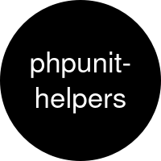

<p align="center">
  <a href="https://github.com/AlexSkrypnyk/phpunit-helpers" rel="noopener">
  </a>
</p>

<h1 align="center">Helpers to work with PHPUnit</h1>

<div align="center">

[](https://github.com/AlexSkrypnyk/phpunit-helpers/issues)
[](https://github.com/AlexSkrypnyk/phpunit-helpers/pulls)
[](https://github.com/AlexSkrypnyk/phpunit-helpers/actions/workflows/test-php.yml)
[](https://codecov.io/gh/AlexSkrypnyk/phpunit-helpers)


</div>

---

## 🧩 Features

| Name                                                    | Source                                         | Description                                                        |
|---------------------------------------------------------|------------------------------------------------|--------------------------------------------------------------------|
| [`UnitTestCase`](#unittestcase)                         | [src](src/UnitTestCase.php)                    | Base test class that includes essential traits for PHPUnit testing |
| [`AssertArrayTrait`](#assertarraytrait)                 | [src](src/Traits/AssertArrayTrait.php)         | Custom assertions for arrays                                       |
| [`ApplicationTrait`](#applicationtrait)                 | [src](src/Traits/ApplicationTrait.php)         | Test Symfony Console applications with assertions                  |
| [`EnvTrait`](#envtrait)                                 | [src](src/Traits/EnvTrait.php)                 | Manage environment variables during tests                          |
| [`LocationsTrait`](#locationstrait)                     | [src](src/Traits/LocationsTrait.php)           | Manage file system locations and directories for tests             |
| [`ProcessTrait`](#processtrait)                         | [src](src/Traits/ProcessTrait.php)             | Run and assert on command line processes during tests              |
| [`SerializableClosureTrait`](#serializableclosuretrait) | [src](src/Traits/SerializableClosureTrait.php) | Make closures serializable for use in data providers               |
| [`ReflectionTrait`](#reflectiontrait)                   | [src](src/Traits/ReflectionTrait.php)          | Access protected and private methods and properties                |
| [`TuiTrait`](#tuitrait)                                 | [src](src/Traits/TuiTrait.php)                 | Interact with and test Textual User Interfaces                     |
| [`StringTrait`](#stringtrait)                           | [src](src/Traits/StringTrait.php)              | String assertions with exact and substring matching                |
| [`LoggerTrait`](#loggertrait)                           | [src](src/Traits/LoggerTrait.php)              | Hierarchical logging with step tracking for test debugging         |

## 📋 Requirements

- PHP 8.3 or newer
- PHPUnit 12.5.24 or newer, or PHPUnit 13

Two traits need a package that this library does not require itself, so add it to your own project when you use them:

| Trait                      | Additional package                |
|----------------------------|-----------------------------------|
| `ApplicationTrait`         | `symfony/console`                 |
| `SerializableClosureTrait` | `laravel/serializable-closure`    |

## 📦 Installation

    composer require --dev alexskrypnyk/phpunit-helpers

## 🚀 Usage

This package provides a collection of traits that can be used in your PHPUnit tests to make testing easier. Below is a description of each trait and how to use it.

### `UnitTestCase`

The `UnitTestCase` class is the base class for unit tests. It includes the `ReflectionTrait` and `LocationsTrait` to provide useful methods for testing.

`setUp()` initialises the test locations and `tearDown()` removes the workspace directory again. The workspace is kept when the test failed or errored, or when debug mode is on, so the produced files can be inspected.

The class also provides an `info()` method that collects additional information about the test from methods whose name ends with `Info`. Methods containing `test` in their name are excluded to avoid conflicts with test methods. The collected information is also appended to the message of any failing assertion, so a failure report carries the test's context without any extra call.

```php
use AlexSkrypnyk\PhpunitHelpers\UnitTestCase;

class MyTest extends UnitTestCase {

  public function testExample(): void {
    // Test implementation that benefits from the included traits.
    echo $this->info();
  }

  public static function environmentInfo(): string {
    return 'Environment: ' . getenv('APP_ENV');
  }

  public function testFixtureInfo(): string {
    // Excluded from info() because the name contains "test".
    return 'This will not appear in info()';
  }

}
```

Debug mode is enabled by the `DEBUG` environment variable or the `--debug` argument, and is readable with `UnitTestCase::isDebug()`:

    DEBUG=1 vendor/bin/phpunit

### `AssertArrayTrait`

The `AssertArrayTrait` provides custom assertions for arrays.

```php
use AlexSkrypnyk\PhpunitHelpers\Traits\AssertArrayTrait;
use PHPUnit\Framework\TestCase;

class MyAssertArrayTest extends TestCase {

  use AssertArrayTrait;

  public function testCustomAssertions(): void {
    $array = ['This is a test', 'Another value'];

    // Assert that a string is present in one of the array values.
    $this->assertArrayContainsString('test', $array);

    // Assert with a custom failure message.
    $this->assertArrayContainsString('test', $array, 'Not found');

    // Assert that a string is absent from all array values.
    $this->assertArrayNotContainsString('missing', $array);

    // Assert that an array contains all elements of a sub-array.
    // Nested arrays are searched recursively.
    $this->assertArrayContainsArray(
      ['a', 'b', ['c', 'd']],
      ['a', ['c', 'd']]
    );

    // Assert that an array contains none of the sub-array elements.
    $this->assertArrayNotContainsArray(['a', 'b'], ['z']);
  }

}
```

### `ApplicationTrait`

The `ApplicationTrait` provides methods to test Symfony Console applications and their commands with comprehensive assertions.

```php
use AlexSkrypnyk\PhpunitHelpers\Traits\ApplicationTrait;
use PHPUnit\Framework\TestCase;

class MyApplicationTest extends TestCase {

  use ApplicationTrait;

  protected function setUp(): void {
    // Working directory, NULL for the current PHP process directory.
    $this->applicationCwd = NULL;
    // Whether to show the output during execution.
    $this->applicationShowOutput = FALSE;
  }

  protected function tearDown(): void {
    $this->applicationTearDown();
  }

  public function testConsoleApplication(): void {
    // Initialize the application from a loader file that returns an
    // Application instance.
    $this->applicationInitFromLoader('/path/to/application_loader.php');

    // Or initialize it from a command class or object. The second
    // argument makes it the single default command.
    $this->applicationInitFromCommand(MyCommand::class, TRUE);

    // Both initializers return the ApplicationTester. The application
    // and the tester are also available on demand.
    $application = $this->applicationGet();
    $tester = $this->applicationGetTester();

    // Run the application with input arguments and options.
    $output = $this->applicationRun(
      // Input arguments and options.
      ['argument1', '--option1=value1'],
      // Application tester options.
      ['capture_stderr_separately' => TRUE],
      // Whether a failure is expected. Defaults to FALSE.
      FALSE
    );

    // Assert on the exit code.
    $this->assertApplicationSuccessful();
    $this->assertApplicationFailed();

    // Assert that the output contains string(s).
    $this->assertApplicationOutputContains('Expected output');
    $this->assertApplicationOutputContains(['String1', 'String2']);
    $this->assertApplicationOutputContains('Expected', 'Not found');

    // Assert that the output does not contain string(s).
    $this->assertApplicationOutputNotContains('Unexpected output');

    // The same assertions are available for the error output.
    $this->assertApplicationErrorOutputContains('Expected error');
    $this->assertApplicationErrorOutputNotContains('Unexpected error');

    // And for the standard and error output combined.
    $this->assertApplicationAnyOutputContains('In either output');
    $this->assertApplicationAnyOutputNotContains('In neither output');

    // Assert several conditions in one call using prefixes. See the
    // StringTrait section for the full prefix reference.
    // Shortcut mode: no prefixes, all must be present as substrings.
    $this->assertApplicationOutputContainsOrNot(['Expected', 'Output']);

    // Mixed mode: if any string has a prefix, all of them must.
    $this->assertApplicationOutputContainsOrNot([
      // Present as a substring.
      '* Expected',
      // Absent as a substring.
      '! Unexpected',
    ]);
    $this->assertApplicationErrorOutputContainsOrNot(['* Error']);
    $this->assertApplicationAnyOutputContainsOrNot(['* Either', '! No']);

    // '+' and '-' compare against the whole trimmed output, so they
    // only make sense for a single-line output.
    $this->assertApplicationOutputContainsOrNot([
      // The whole output must equal this.
      '+ Hello, World!',
    ]);

    // Get debug info about the application (output, error output).
    echo $this->applicationInfo();
  }

}
```

### `EnvTrait`

The `EnvTrait` helps manage environment variables during tests. Every method is static, so it is also usable from data providers.

```php
use AlexSkrypnyk\PhpunitHelpers\Traits\EnvTrait;
use PHPUnit\Framework\TestCase;

class MyEnvTest extends TestCase {

  use EnvTrait;

  public function testEnvironmentVariables(): void {
    // Set an environment variable.
    self::envSet('MY_VAR', 'value');

    // Set multiple environment variables.
    self::envSetMultiple(['VAR1' => 'value1', 'VAR2' => 'value2']);

    // Get an environment variable. Returns FALSE when it is not set.
    $value = self::envGet('MY_VAR');

    // Check whether an environment variable is set.
    $is_set = self::envIsSet('MY_VAR');
    $is_unset = self::envIsUnset('MY_VAR');

    // Unset an environment variable.
    self::envUnset('MY_VAR');

    // Unset multiple environment variables.
    self::envUnsetMultiple(['VAR1', 'VAR2']);

    // Unset every environment variable with a given prefix.
    self::envUnsetPrefix('MY_');

    // Set environment variables from an input array. Matching entries
    // are removed from the input array unless the third argument is
    // FALSE.
    $input = ['MY_VAR' => 'value', 'other' => 'kept'];
    self::envFromInput($input, 'MY_');

    // Unset every variable that was set through this trait.
    self::envReset();
  }

}
```

### `LocationsTrait`

The `LocationsTrait` provides methods to manage file system locations during tests. It maintains a set of predefined directories as static properties, so they are also reachable from data providers.

```php
use AlexSkrypnyk\PhpunitHelpers\Traits\LocationsTrait;
use PHPUnit\Framework\TestCase;

class MyLocationsTest extends TestCase {

  use LocationsTrait;

  protected function setUp(): void {
    // Create the test directories.
    $this->locationsInit();

    // Root directory of the project.
    echo self::$root;
    // Fixtures directory, or NULL when it does not exist.
    echo self::$fixtures;
    // Workspace directory holding the assets of a single test run.
    echo self::$workspace;
    // Source directory for operations.
    echo self::$repo;
    // System Under Test directory where the test runs.
    echo self::$sut;
    // Temporary files directory.
    echo self::$tmp;

    // The same paths are available through accessors.
    echo self::locationsRoot();
    echo self::locationsFixtures();
    echo self::locationsWorkspace();
    echo self::locationsRepo();
    echo self::locationsSut();
    echo self::locationsTmp();

    // Print all locations at once.
    echo self::locationsInfo();
  }

  protected function tearDown(): void {
    // Remove the workspace directory and everything below it.
    $this->locationsTearDown();
  }

  /**
   * Override to point at a different fixtures directory.
   *
   * Defaults to 'tests/Fixtures', relative to the repository root.
   */
  public static function locationsFixturesDir(): string {
    return 'tests/Fixtures';
  }

  public function testFileOperations(): void {
    // Get a named fixtures directory, creating it if needed.
    $fixtures_dir = $this->locationsFixtureDir('my-fixture');

    // Without a name, the directory is derived from the test name, and
    // a named data set adds a further subdirectory. The data set named
    // 'baseline' maps to the '_baseline' directory.
    $fixtures_dir = $this->locationsFixtureDir();

    // Copy files into the SUT directory.
    $files = self::locationsCopyFilesToSut(['file1.txt', 'file2.txt']);

    // A random numeric suffix is appended by default. Pass FALSE as the
    // third argument to keep the original file names.
    $this->assertFileExists(self::$sut . '/file1.txt1234');

    // Copy between arbitrary directories. '.git', 'node_modules' and
    // 'vendor' are always excluded.
    $created = self::locationsCopy(self::$repo, self::$sut);

    // Create a directory if needed and return its real path.
    $path = self::locationsMkdir(self::$tmp . '/nested');

    // Resolve a real path, throwing when it does not exist.
    $real = self::locationsRealpath($path);
  }

}
```

### `ProcessTrait`

The `ProcessTrait` provides methods to run command line processes and assert on their output and exit codes. It integrates with the Symfony Process component for safe and controlled command execution.

```php
use AlexSkrypnyk\PhpunitHelpers\Traits\ProcessTrait;
use PHPUnit\Framework\TestCase;

class MyProcessTest extends TestCase {

  use ProcessTrait;

  protected function setUp(): void {
    // Working directory, NULL for the current PHP process directory.
    $this->processCwd = NULL;
    // Whether to stream the output while the process runs.
    $this->processStreamingOutput = FALSE;
  }

  protected function tearDown(): void {
    // Stop the process if it is still running.
    $this->processTearDown();
  }

  public function testCommandExecution(): void {
    // Run a command with arguments, inputs, environment variables and
    // timeouts. The command name is validated, and every argument must
    // be scalar. An environment variable set to FALSE is removed from
    // the inherited environment.
    $process = $this->processRun(
      // Command to execute, optionally with arguments.
      'echo',
      // Additional command arguments.
      ['Hello', 'World'],
      // Inputs for an interactive process.
      ['Input1', 'Input2'],
      // Additional environment variables.
      ['ENV_VAR' => 'value'],
      // Process timeout in seconds.
      60,
      // Process idle timeout in seconds.
      30
    );

    // The most recent process is also available on demand.
    $process = $this->processGet();

    // Assert on the exit code.
    $this->assertProcessSuccessful();
    $this->assertProcessFailed();

    // Assert that the output contains string(s).
    $this->assertProcessOutputContains('Hello World');
    $this->assertProcessOutputContains(['Hello', 'World']);
    $this->assertProcessOutputContains('Hello', 'Not found');

    // Assert that the output does not contain string(s).
    $this->assertProcessOutputNotContains('Error');
    $this->assertProcessOutputNotContains(['Error1', 'Error2']);

    // The same assertions are available for the error output.
    $this->assertProcessErrorOutputContains('Warning');
    $this->assertProcessErrorOutputNotContains('Critical');

    // And for the standard and error output combined.
    $this->assertProcessAnyOutputContains('In either output');
    $this->assertProcessAnyOutputNotContains('In neither output');

    // Assert several conditions in one call using prefixes. See the
    // StringTrait section for the full prefix reference.
    // Shortcut mode: no prefixes, all must be present as substrings.
    $this->assertProcessOutputContainsOrNot(['Hello', 'World']);

    // Mixed mode: if any string has a prefix, all of them must.
    $this->assertProcessOutputContainsOrNot(['* Hello', '! Error']);
    $this->assertProcessErrorOutputContainsOrNot(['* Warning']);
    $this->assertProcessAnyOutputContainsOrNot(['* Hello', '! Error']);

    // '+' and '-' compare against the whole trimmed output, so they
    // only make sense for a single-line output.
    $this->assertProcessOutputContainsOrNot([
      // The whole output must equal this.
      '+ Hello World',
    ]);
  }

}
```

### `SerializableClosureTrait`

The `SerializableClosureTrait` makes closures serializable so they can be used in data providers. It works with both traditional closures and arrow functions, and requires the `laravel/serializable-closure` package.

```php
use AlexSkrypnyk\PhpunitHelpers\Traits\SerializableClosureTrait;
use PHPUnit\Framework\Attributes\DataProvider;
use PHPUnit\Framework\TestCase;

class MyClosureTest extends TestCase {

  use SerializableClosureTrait;

  #[DataProvider('dataProviderWithClosure')]
  public function testWithClosure($callback): void {
    // Unwrap the closure before using it.
    $callback = self::cu($callback);
    $this->assertEquals('ARGUMENT', $callback('argument'));
  }

  public static function dataProviderWithClosure(): array {
    return [
      'traditional' => [
        self::cw(function ($value) {
          return strtoupper($value);
        }),
      ],
      'arrow_function' => [
        self::cw(fn($value) => strtoupper($value)),
      ],
    ];
  }

}
```

### `ReflectionTrait`

The `ReflectionTrait` provides methods to access and manipulate protected or private members of classes or objects.

```php
use AlexSkrypnyk\PhpunitHelpers\Traits\ReflectionTrait;
use PHPUnit\Framework\TestCase;

class MyReflectionTest extends TestCase {

  use ReflectionTrait;

  public function testProtectedMethod(): void {
    $object = new SomeClass();

    // Call a protected method. Pass a class name instead of an object
    // to call a protected static method.
    $result = self::callProtectedMethod($object, 'protectedMethod', [
      'argument',
    ]);

    // Set a protected property value.
    self::setProtectedValue($object, 'protectedProperty', 'new value');

    // Get a protected property value.
    $value = self::getProtectedValue($object, 'protectedProperty');
  }

}
```

### `TuiTrait`

The `TuiTrait` provides constants and methods for interacting with a Textual User Interface (TUI) during tests, handling keystroke simulation and input entries. It supports both full-string input and character-by-character input simulation.

A "keystroke" is a single key or special key, while an "entry" is one or more keystrokes forming a complete input.

```php
use AlexSkrypnyk\PhpunitHelpers\Traits\TuiTrait;
use PHPUnit\Framework\TestCase;

class MyTuiTest extends TestCase {

  use TuiTrait;

  public function testTuiInteraction(): void {
    // Define the default entries for all sets.
    $default_entries = [
      'answer1' => 'value1',
      // Replaced with the default value, an empty string by default.
      'answer2' => self::TUI_DEFAULT,
      'answer3' => 'value3',
      'answer4' => 'value4',
    ];

    // First entry set: use the default for 'answer1'.
    $entries_set1 = ['answer1' => self::TUI_DEFAULT] + $default_entries;
    $processed_entries = self::tuiEntries($entries_set1);

    // Process entries with a custom default value.
    $processed_entries = self::tuiEntries($entries_set1, 'custom');

    // Second entry set: skip 'answer2' so it is left out entirely.
    $entries_set2 = ['answer2' => self::TUI_SKIP] + $default_entries;
    $processed_entries = self::tuiEntries($entries_set2);

    // Convert entries to keystrokes for character-by-character input.
    $keystrokes = self::tuiKeystrokes($entries_set1);

    // Keystroke conversion with options.
    $keystrokes = self::tuiKeystrokes(
      // Entries to convert.
      $entries_set1,
      // Number of characters to clear before entering new text.
      3,
      // Accept key. Defaults to the Enter key.
      self::KEYS['TAB'],
      // Clear key. Defaults to the Backspace key.
      self::KEYS['BACKSPACE']
    );

    // Convert a single entry into its keystrokes.
    $split = self::tuiEntryToKeystroke('ab' . self::KEYS['ENTER']);

    // Special keys are available as constants.
    $up_key = self::KEYS['UP'];
    $enter_key = self::KEYS['ENTER'];
    $tab_key = self::KEYS['TAB'];
    $esc_key = self::KEYS['ESCAPE'];
    $ctrl_c = self::KEYS['CTRL_C'];
    $backspace = self::KEYS['BACKSPACE'];

    // Arrow keys are supported in more than one format.
    $up_arrow = self::KEYS['UP_ARROW'];

    // Yes and No entries are predefined and can be overridden.
    $yes = self::$tuiYes;
    $no = self::$tuiNo;

    // Check whether a value is, or contains, a special key.
    $is_key = self::tuiIsKey($enter_key);
    $has_key = self::tuiHasKey('abc' . $enter_key);
  }

}
```

### `StringTrait`

The `StringTrait` provides the `assertStringContainsOrNot()` assertion used by the `ApplicationTrait` and `ProcessTrait` prefix assertions. Four single-character prefixes control how each expected value is matched:

| Prefix | Meaning              | Compared against    |
|--------|----------------------|---------------------|
| `+`    | Exact match present  | The entire haystack |
| `*`    | Substring present    | Any position        |
| `-`    | Exact match absent   | The entire haystack |
| `!`    | Substring absent     | Any position        |

`+` and `-` compare the value against the whole haystack, not against a word inside it, so they are only useful for short, single-line strings.

There are two modes. In shortcut mode no value carries a prefix and all of them are treated as "substring present". In mixed mode at least one value carries a prefix, and then every value must carry one.

```php
use AlexSkrypnyk\PhpunitHelpers\Traits\StringTrait;
use PHPUnit\Framework\TestCase;

class MyStringTest extends TestCase {

  use StringTrait;

  public function testSimpleStringMatching(): void {
    $haystack = 'The quick brown fox jumps over the lazy dog';

    // Shortcut mode: all values must be present as substrings.
    $this->assertStringContainsOrNot($haystack, [
      'quick',
      'brown',
      'fox',
    ]);

    // Mixed mode: every value carries a prefix.
    $this->assertStringContainsOrNot($haystack, [
      // Present as a substring.
      '* brown',
      // Absent as an exact match of the whole haystack.
      '- slow',
      // Absent as a substring.
      '! elephant',
    ]);

    // '+' matches the whole haystack.
    $this->assertStringContainsOrNot('Hello', ['+ Hello']);

    // Matching is case-insensitive by default.
    $this->assertStringContainsOrNot('Hello WORLD', ['* world']);

    // Case-sensitive matching, with the defaults spelled out.
    $this->assertStringContainsOrNot(
      'Hello WORLD',
      ['* WORLD', '! world'],
      'Expected exact match for "%s" in haystack',
      'Expected substring "%s" in haystack',
      'Expected no exact match for "%s" in haystack',
      'Expected substring "%s" not in haystack',
      // Prefixes: present exact, present contains, absent exact,
      // absent contains.
      '+', '*', '-', '!',
      // Separator between the prefix and the value.
      ' ',
      // Case-insensitive matching, turned off here.
      FALSE
    );

    // Custom prefixes.
    $this->assertStringContainsOrNot(
      $haystack,
      ['~ brown', '_ slow', '? elephant'],
      'Expected exact match for "%s" in haystack',
      'Expected substring "%s" in haystack',
      'Expected no exact match for "%s" in haystack',
      'Expected substring "%s" not in haystack',
      // Present exact.
      '#',
      // Present contains.
      '~',
      // Absent exact.
      '_',
      // Absent contains.
      '?'
    );
  }

}
```

All four prefixes must be single, unique characters, and a value that is empty after its prefix is stripped raises a `RuntimeException`.

### `LoggerTrait`

The `LoggerTrait` provides a hierarchical logging system for test debugging, with step tracking, timing and nested workflows. Output is written to `STDERR` and is suppressed unless verbose mode is enabled, so the default test output stays clean.

```php
use AlexSkrypnyk\PhpunitHelpers\Traits\LoggerTrait;
use PHPUnit\Framework\TestCase;

class MyLoggerTest extends TestCase {

  use LoggerTrait;

  protected function setUp(): void {
    static::logSetVerbose(TRUE);
  }

  public function testHierarchicalWorkflow(): void {
    static::log('Basic debug message');
    static::logSection('SECTION TITLE', 'Section content');
    static::logFile('/path/to/file.txt', 'Optional description');

    // Step tracking with automatic timing. The step name is taken from
    // the calling method, so the argument is only a message.
    static::logStepStart('Optional step message');
    static::logSubstep('Processing data');
    static::logNote('Additional context information');

    // A step started inside another step nests below it.
    $this->stepNested();

    static::logStepFinish('Step completed successfully');

    // logStepSummary() returns the table rather than printing it.
    static::logSection('WORKFLOW SUMMARY', static::logStepSummary(), TRUE, 80);
  }

  protected function stepNested(): void {
    static::logStepStart('Nested operation');
    static::logStepFinish('Nested operation complete');
  }

}
```

**Available logging methods:**

- `log(string)` - basic message logging
- `logSection(string, ?string, bool, int)` - bordered section with an optional double border and a minimum width
- `logFile(string, ?string)` - file contents between section borders
- `logStepStart(?string)` - begin step tracking, naming the step after the calling method
- `logStepFinish(?string)` - end step tracking and record the elapsed time
- `logSubstep(string)` - indented substep message
- `logNote(string)` - indented note message
- `logStepSummary(string)` - return the step summary table, indenting nested steps by the given string
- `logInfo()` - the step summary under a heading, collected by `UnitTestCase::info()`
- `logSetVerbose(bool)` - enable or disable output
- `logSetOutputStream(resource|null)` - set the output stream, or NULL for `STDERR`

**Example step summary output:**

```
==============================[ WORKFLOW SUMMARY ]==============================
+-----------------------------+----------+---------+
| Step                        | Status   | Elapsed |
+-----------------------------+----------+---------+
| stepDeploymentProcess       | Complete | 2m 15s  |
|   stepDatabaseMigration     | Complete | 1m 23s  |
|   stepApplicationDeployment | Complete | 45s     |
|     stepAssetCompilation    | Complete | 32s     |
+-----------------------------+----------+---------+
================================================================================
```

### Using multiple traits

Traits can be combined in a single test class:

```php
use AlexSkrypnyk\PhpunitHelpers\Traits\ApplicationTrait;
use AlexSkrypnyk\PhpunitHelpers\Traits\AssertArrayTrait;
use AlexSkrypnyk\PhpunitHelpers\Traits\EnvTrait;
use AlexSkrypnyk\PhpunitHelpers\Traits\LoggerTrait;
use AlexSkrypnyk\PhpunitHelpers\Traits\ProcessTrait;
use AlexSkrypnyk\PhpunitHelpers\Traits\ReflectionTrait;
use AlexSkrypnyk\PhpunitHelpers\Traits\TuiTrait;
use PHPUnit\Framework\TestCase;

class MyCombinedTest extends TestCase {

  use ApplicationTrait;
  use AssertArrayTrait;
  use EnvTrait;
  use LoggerTrait;
  // ApplicationTrait and ProcessTrait both include StringTrait.
  use ProcessTrait;
  use ReflectionTrait;
  use TuiTrait;

  // Your test methods.

}
```

Or extend `UnitTestCase`, which already includes the `LocationsTrait` and `ReflectionTrait`:

```php
use AlexSkrypnyk\PhpunitHelpers\Traits\EnvTrait;
use AlexSkrypnyk\PhpunitHelpers\UnitTestCase;

class MyTest extends UnitTestCase {

  // Add further traits as needed.
  use EnvTrait;

  // Your test methods.

}
```

Every trait declares `@mixin \PHPUnit\Framework\TestCase`, so it must be used inside a PHPUnit test class.

## 🤝 Contributing

See [`CONTRIBUTING.md`](CONTRIBUTING.md) for local development setup and the linting and testing commands.

## 🔄 Updating

To pull the latest infrastructure from the template into this project, ask Claude Code to "update scaffold" - see [`AGENTS.md`](AGENTS.md) for details.

---
_This repository was created using the [Scaffold](https://getscaffold.dev/) project template_
